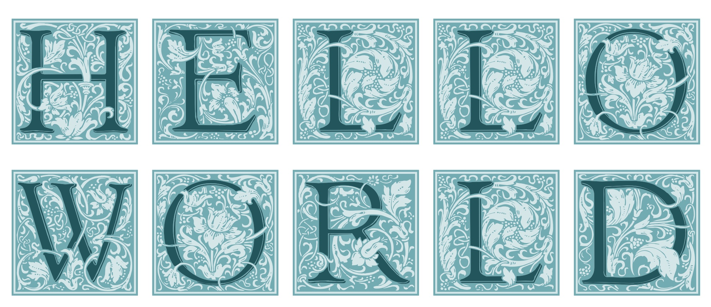

# Latex Illuminated Capitals

Provides functions for drawing the illuminated capitals from [Goudy Initialen](https://tug.org/FontCatalogue/goudyinitialen/) with the letters colored in for contrast

